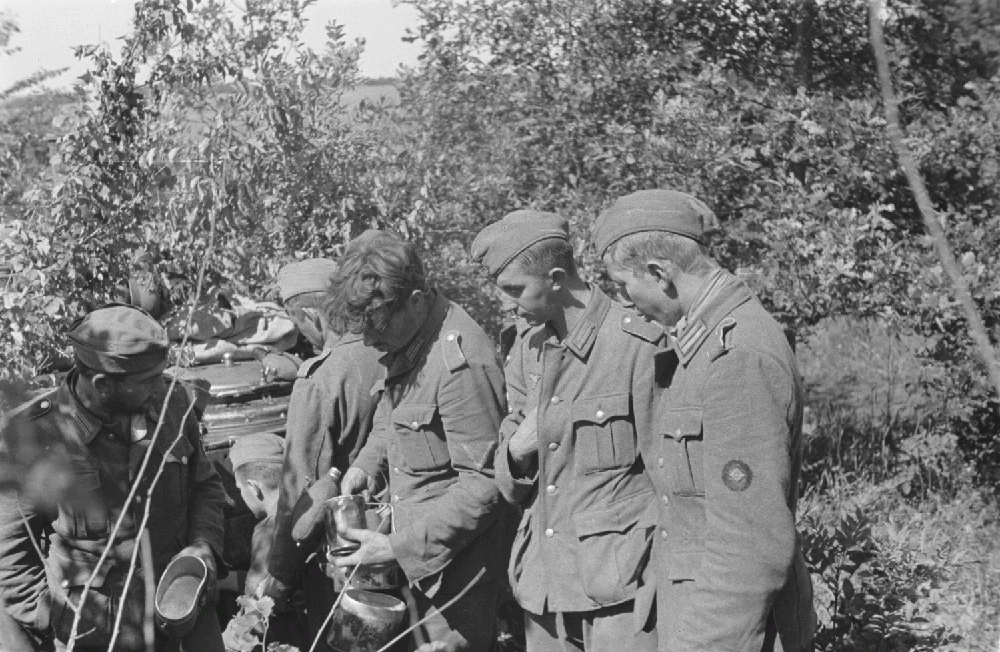
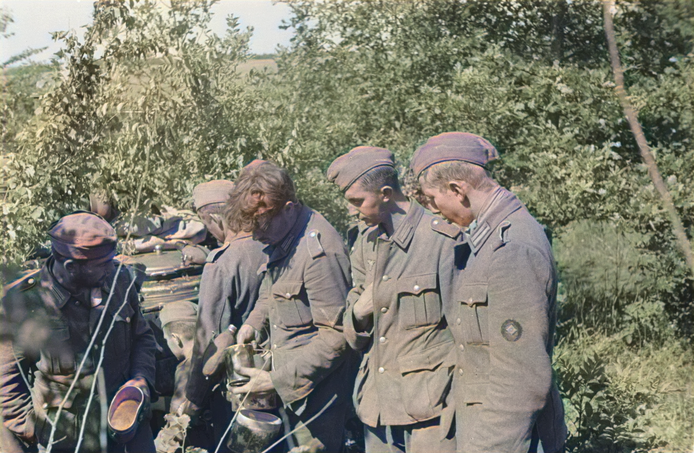

# VividHistory_colorization
This script allows two main operations to be performed via the command line: searching Europeana and colouring images. Depending on the --process parameter, the script invokes the appropriate Python scripts, allowing data to be collected from Europeana or a colouring effect to be applied to images. The workflow is easily configurable thanks to the arguments passed via the command line.

## Collecting arguments via the command line
The main topics collected include:
--process: determines the type of process to execute, which can be ‘europeana’ (for searching Europeana) or ‘colorize’ (for colouring images).
--outDir: specifies the output directory where the results are to be saved.
- Additional parameters specific to each process, such as:
    --europeanaToken, --europeanaQuery, --maxRows for the Europeana search process.
    --input for the input image in the case of the colouring process.

## Europeans' process
If the --process parameter is set to ‘europeana’, the script executes another Python script (europeana_search.py) to search for data via the Europeana API.
The parameters --europeanaToken, --europeanaQuery and --maxRows are passed to configure the search, and the results are saved in the specified output directory.

## Colorize' process
If the --process parameter is set to ‘colorize’, the script executes the image colourisation process via another Python script (img_colorization.py).
The --input parameter is provided to specify the image to be coloured, along with a process order (in this case, ‘DeOldify’) and the output directory via --output.

## Error management
If the --process parameter is invalid (other than ‘european’ or ‘colorize’), the script terminates with an error and a message indicating the cause of the problem.

# Installation
In the folder provided is the `Dockerfile`, which contains all the libraries required for the application to function correctly. Alternatively, you can download the pre-compiled image directly from Docker Hub by running the following command:

`docker pull 3domfbk/vividhistory_colorization:<tag>`

## Example
Below is an example:

`docker run --rm -it -v <_HOST_PATH_>:/data 3domfbk/vividhistory_colorization:<tag> --process colorize --outDir /data --input /data/<_IMG_NAME>.jpg`

